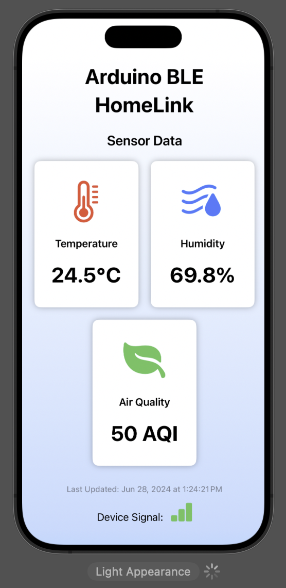
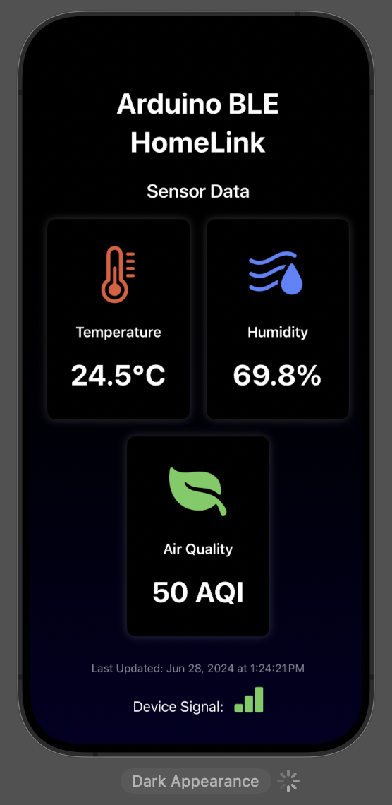
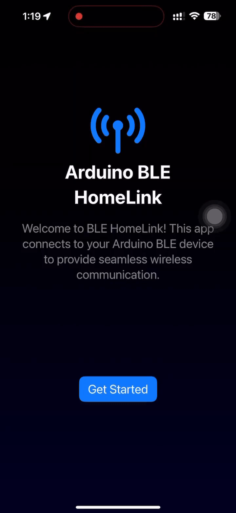

# Arduino BLE HomeLink

Welcome to the Arduino BLE HomeLink! This app connects to your Arduino BLE device to provide seamless wireless communication.

## Features

- **Temperature Monitoring:** Displays the current temperature.
- **Humidity Monitoring:** Displays the current humidity.
- **Air Quality Monitoring:** Displays the current air quality index (AQI).
- **Signal Strength:** Shows the signal strength of the connected BLE device.

## Screenshots

### Light Mode



### Dark Mode



## Demo

Watch the demo GIF to see Arduino BLE HomeLink in action:



## Arduino Setup

To set up your Arduino for BLE communication, follow these steps:

1. **Hardware Requirements:**
   - Arduino Uno R4 WiFi
   - DHT22 sensor for temperature and humidity
   - MQ135 sensor for air quality
   - 20x4 I2C LCD for displaying data
   - Breadboard and connecting wires

2. **Software Requirements:**
   - Arduino IDE
   - Necessary Arduino libraries:
     - `ArduinoBLE.h` library
     - `DHT.h` by Adafruit
     - `LiquidCrystal_I2C.h` for LCD

3. **Connections:**
   - Connect the DHT11/DHT22 sensor to the Arduino:
     - VCC to 5V
     - GND to GND
     - Data pin to digital pin 4
   - Connect the MQ135 sensor:
     - VCC to 5V
     - GND to GND
     - Analog output to A0
   - Connect I2C LCD:
     - VCC to 5V
     - GND to GND
     - SDA to A4
     - SCL to A5

## Installation

To run this app, you need to have Xcode installed on your Mac. Follow the steps below to set it up:

1. Clone the repository:
    ```bash
    git clone https://github.com/your-repo/arduino-ble-homelink.git
    cd arduino-ble-homelink
    ```

2. Open the project in Xcode:
    ```bash
    open HomeLink.xcodeproj
    ```

3. Build and run the app on your simulator or device.

## Usage

1. **Start the App:** Launch the app on your iOS device.
2. **Connect to BLE Device:** Click on "Get Started" to scan for and connect to your Arduino BLE device.
3. **Monitor Data:** View the temperature, humidity, and air quality data on the home screen.
4. **Check Signal Strength:** The signal strength indicator shows the connection quality.

## Development

### Requirements

- Xcode 12.0 or later
- iOS 14.0 or later

### Building and Running

1. Open the project in Xcode:
    ```bash
    open HomeLink.xcodeproj
    ```

2. Select your target device or simulator.
3. Press `Cmd + R` to build and run the project.

### Folder Structure

- `HomeLink/`: Contains the main project files.
- `HomeLink/Views/`: Contains SwiftUI view files.
- `HomeLink/Model/`: Contains model files.
- `HomeLink/Manager/`: Contains BLE management files.